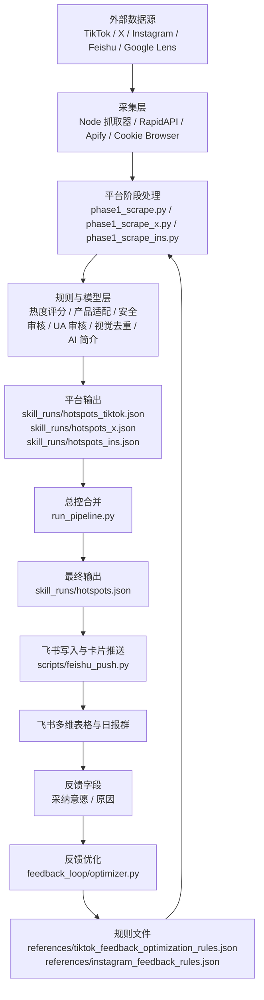

# 社媒热点筛选与推送项目产品文档

更新日期：2026-06-15  
适用范围：`C:\Users\lyb\Desktop\gurugame\social-media-hotspots` 当前代码版本

## 1. 项目定位

本项目是一个面向 AI 产品增长和产品灵感沉淀的社媒热点发现系统。系统从 TikTok、X、Instagram 等平台采集热点内容，通过规则过滤、热度评分、产品适配、AI 审核、安全审核、视觉去重、AI 简介生成和飞书推送，将每日可用素材写入飞书多维表格并发送飞书日报。

核心使用方：

- UA 侧：寻找可用于广告素材、广告钩子、广告结构、投放创意参考的社媒热点。
- 产品侧：发现可沉淀为 AI 产品功能、模板、玩法、交互、素材库方向的热点。

当前产品范围以 `references/product_material_requirements.md` 为准，只服务：

- Evoke：AI Photo Enhancer，重点是照片增强、修复、老照片复活、AI 肖像。
- Toki：AI Video Generator，重点是 photo-to-video、动作模板、AI emote、AI dance、AI hug、真人舞蹈趋势/舞蹈挑战动作模板等。
- Kavi：轻量 AI 视频生成，重点是自拍/单张照片转短视频、viral AI effect、真人 dance trend / dance challenge、3D figure、creator persona。
- Avatar：Facebook Instant Game / avatar jigsaw，重点是头像生成、clay avatar、拼图和社交裂变。

所有最终推送素材的 `推送对象` 当前统一写入 `ALL`。代码中仍保留部分历史 `UA`、`产品` 中间字段，用于过程判断和兼容旧逻辑，但飞书写入阶段会统一规范化。

## 2. 总体架构



主流程分三阶段：

1. Stage 0：`feedback_loop/optimizer.py` 读取飞书反馈，更新 TikTok/X 规则。
2. Stage 1：`run_pipeline.py` 并发运行各平台阶段脚本，生成平台热点 JSON。
3. Stage 2：`scripts/feishu_push.py` 写入飞书多维表格并推送飞书日报卡片。

## 3. 技术栈与运行时

| 类别 | 使用内容 | 代码位置 |
| --- | --- | --- |
| 总控语言 | Python | `run_pipeline.py`、`scripts/`、`feedback_loop/` |
| 抓取器 | Node.js | `trend-scrap/tiktok-scraper/`、`trend-scrap/x-scraper/` |
| 浏览器自动化 | Playwright | `scripts/tiktok_keyword_discovery.py`、`scripts/manual/ins_keyword_discovery.py`、Google Lens 流程 |
| HTTP/API | requests、RapidAPI、Apify、Feishu Open API、OpenRouter/OpenAI 兼容接口 | 多个脚本 |
| 本地存储 | JSON、SQLite、Excel 评估文件 | `skill_runs/`、`x_history_eval/` |
| 测试 | unittest | `tests/` |
| 可选视觉处理 | Pillow | `scripts/slider_puzzle_solver.py`、测试夹具 |

Python 依赖见 `requirements.txt`：

```text
openai>=1.0.0
pypdf>=4.0.0
requests>=2.30.0
openpyxl>=3.1.0
playwright>=1.58.0
Pillow>=10.0.0
yt-dlp>=2026.5.25
```

Node 依赖：

- `trend-scrap/tiktok-scraper/package.json`：TikTok 抓取器，依赖 `apify-client`。
- `trend-scrap/x-scraper/package.json`：X 抓取器，使用 Node 原生能力调用 RapidAPI。

## 4. 目录结构

| 路径 | 作用 |
| --- | --- |
| `run_pipeline.py` | 日常主入口，负责 Stage 0/1/2 调度、平台并发、合并、总量上限、监控报告。 |
| `.env.example` | 环境变量模板。部署时复制为 `.env` 并填写真实密钥。 |
| `requirements.txt` | Python 依赖清单。 |
| `README.md` | 旧版说明文档，包含历史背景。当前部署和架构以本文件为准。 |
| `references/` | 规则、产品素材需求、推送规则。 |
| `scripts/` | 主业务脚本和共享模块。 |
| `scripts/instagram/` | Instagram 独立规则、采集、评分、审核、存储模块。(由于封号问题废弃的ins爬取器) |
| `scripts/manual/` | 手动或旁路工具，默认不写飞书、不覆盖主流程产物。 |
| `scripts/us_t1/` | 美国 T1 英文素材独立推送流程，不属于日常主流程。 |
| `feedback_loop/` | 飞书反馈读取、规则优化、灰度报告。 |
| `trend-scrap/` | TikTok 和 X 的 Node 抓取器。 |
| `google-lens-eagle-import/` | Google Images + Google Lens + Instagram 过滤旁路流程和 Eagle 导入 skill。（已经废弃） |
| `docs/` | 设计方案、历史计划、规则调整记录。 |
| `tests/` | 单元测试。 |
| `skill_runs/` | 运行产物、日志、监控、缓存、数据库、手动审核输出。 |
| `skill_runs/tiktok_keyword_discovery/` | TikTok keyword discovery 的运行产物与状态目录，保存独立 cookie 搜索、搜索页解析、详情页回填、过滤审核、人工验证和报告文件。源码入口是 `scripts/tiktok_keyword_discovery.py`。 |
| `x_history_eval/` | X 历史样本、评分结果和评估产物。 |

## 5. 主入口：run_pipeline.py

代码位置：`run_pipeline.py`

主要职责：

- 读取 `.env` 与命令行参数。
- 解析平台列表：`tiktok`、`x`、`ins`，支持别名 `twitter -> x`、`instagram -> ins`。
- 解析灰度变体：`legacy`、`product_v2`、`auto`。
- 调用反馈优化脚本。
- 并发运行平台阶段脚本。
- 合并平台输出、去重、应用最终 guardrail、应用推送总量上限。
- 合并旁路的 TikTok keyword discovery 和 Instagram keyword discovery 批准结果。
- 调用飞书写入和卡片推送。
- 写入监控报告。

关键常量：

| 常量 | 含义 |
| --- | --- |
| `PLATFORM_OUTPUTS` | 平台阶段输出：`skill_runs/hotspots_tiktok.json`、`skill_runs/hotspots_x.json`、`skill_runs/hotspots_ins.json`。 |
| `PLATFORM_SCRIPTS` | 平台脚本映射：TikTok、X、Instagram 分别对应三个 phase1 脚本。 |
| `HOTSPOTS_FILE` | 合并后的最终文件：`skill_runs/hotspots.json`。 |
| `MONITOR_DIR` | 监控报告目录：`skill_runs/pipeline_monitor`。 |

关键函数：

| 函数 | 功能 |
| --- | --- |
| `resolve_platforms()` | 解析平台参数和环境变量 `PIPELINE_PLATFORMS`。 |
| `run_platform()` | 启动单个平台阶段脚本，写平台日志，处理超时和输出校验。 |
| `run_platforms()` | 根据 `PIPELINE_PARALLEL_PLATFORMS` 和 `PIPELINE_MAX_WORKERS` 并发运行平台。 |
| `merge_hotspots()` | 读取各平台输出，合并关键词发现旁路结果，去重，应用最终规则和总量上限。 |
| `apply_push_caps()` | 按 `references/tiktok_feedback_optimization_rules.json -> push_caps` 控制每日总推送上限。 |
| `write_monitor_reports()` | 写 `latest.json` 和单次运行归档报告。 |

主命令：

```powershell
python run_pipeline.py --platforms tiktok,x,ins
```

常用参数：

| 参数 | 作用 |
| --- | --- |
| `--platforms tiktok,x,ins` | 指定运行平台。 |
| `--skip-feedback` | 跳过飞书反馈规则优化。 |
| `--skip-scrape` | 复用已有平台抓取结果，只跑过滤、评分、审核。 |
| `--skip-feishu` | 只生成本地 JSON，不写飞书、不推送卡片。 |
| `--dry-run-feishu` | 构造飞书写入 payload 和卡片，但不真实发送。 |
| `--variant legacy/product_v2/auto` | 指定筛选逻辑变体。 |

## 6. 规则体系

### 6.1 TikTok/X 规则

代码读取位置：`scripts/feedback_rules.py`  
规则文件：`references/tiktok_feedback_optimization_rules.json`

顶层规则块：

| 规则块 | 作用 |
| --- | --- |
| `scrape` | TikTok 搜索词、抓取数量、非 AI 扩展词。 |
| `x_scrape` | X 搜索词、抓取数量、分页和查询限制。 |
| `scoring` / `x_scoring` | 热度评分权重。 |
| `quality_thresholds` / `x_quality_thresholds` | 时间、评论、点赞、播放、视频时长等质量阈值。 |
| `media_type_weights` | 图片、视频、图文/混合素材的权重。 |
| `audience_targeting` | UA/产品目标判断的学习结果。 |
| `ua_material_review` | 非 AI 或泛素材进入 UA 审核的模型配置和池大小。 |
| `push_caps` | 最终每日推送总量上限。 |
| `product_targeting` | Evoke/Toki/Kavi/Avatar 产品适配规则。 |
| `x_photo_relevance` | X 真人图片相关性判断。 |
| `x_team_demand` | X 团队需求候选识别。 |
| `filters` | include/exclude 关键词、硬排除组。 |
| `analysis_prompt` | AI 简介分析提示词。 |
| `learning_summary` | 反馈优化总结。 |
| `ua_geo_targeting` | UA 国家定向信号。 |

### 6.2 Instagram 规则

代码读取位置：`scripts/instagram/ins_rules.py`  
规则文件：`references/instagram_feedback_rules.json`

顶层规则块：

| 规则块 | 作用 |
| --- | --- |
| `provider` | Instagram 采集 provider 配置。 |
| `creator_pool` | 创作者池 CSV、每次运行创作者数量、回看窗口。 |
| `database` | Instagram SQLite 数据库位置。 |
| `rapidapi` | Instagram RapidAPI host、path、timeout。 |
| `content_mode` | posts-only、图片素材优先等策略。 |
| `quality` | 最小点赞、评论、top_n、product_v2_top_n。 |
| `hot_post` | 基于创作者历史均值的高热过滤。 |
| `scoring` | Instagram 热度评分权重。 |
| `product_fit` | Instagram 产品适配规则。 |
| `product_v2_review` | Instagram 产品侧模型审核。 |
| `intro_analysis` | Instagram AI 简介模型配置。 |
| `ua_material_review` | Instagram UA 素材模型审核。 |
| `safety` | Instagram 安全审核。 |
| `dedupe` | Instagram 视觉去重。 |
| `creator_discovery` / `creator_search` | 创作者发现与搜索配置。 |

## 7. 平台模块

### 7.1 TikTok 日常流程

主流程入口：`scripts/tiktok_discovery_routes.py`  
传统单路入口：`scripts/phase1_scrape.py`  
Node 抓取器：`trend-scrap/tiktok-scraper/src/scraper.js`  
抓取器配置：`trend-scrap/tiktok-scraper/config/config.json`  
阶段输出：`skill_runs/hotspots_tiktok.json`、`skill_runs/hotspots_tiktok_ua.json`、`skill_runs/hotspots_tiktok_product.json`

实现方式：

1. 主流程 TikTok 入口运行两条 Discovery 路线：`tiktok-UA` 和 `tiktok-Product`。
2. `tiktok-UA` 使用默认分层关键词、7 日窗口、`<=60s` 时长，保留安全过滤、反馈排除、视觉去重和 UA 审核，输出 `skill_runs/hotspots_tiktok_ua.json`。
3. `tiktok-Product` 使用舞蹈趋势固定 15 词配置、90 日窗口、`<=15s` 时长，按 7 日 / 30 日 / 90 日三个窗口分别选品，输出 `skill_runs/hotspots_tiktok_product.json`。
4. 两条路线按 URL 合并为 `skill_runs/hotspots_tiktok.json`；同 URL 同时命中 UA 和 Product 时合并元数据并写为 `pushObject: "ALL"`。
5. Product 路线最终项固定写为 `pushObject: "ALL"`，不再产出 legacy `产品`。
6. Product 路线中的舞蹈素材只接受成人、单人主角；该规则只绑定 15 个舞蹈相关搜索词，不影响未来切换到其他搜索词的 Product 发现。
7. Product 路线不再把中文趋势简介作为封面展示文本，改为生成内部字段 `tiktokProductEffectName`，并同步写入 `hotspotIntro` 供飞书“热点简介”列使用。
8. 非 Product 的 TikTok / X / Instagram 记录仍沿用原有 AI 热点简介逻辑。

关键函数：

| 函数 | 功能 |
| --- | --- |
| `run_tiktok_scraper()` | 启动 Node TikTok 抓取器。 |
| `filter_by_time_window()` | 按 `max_hours` 过滤，hot-feed 模板信号可绕过时间窗口。 |
| `filter_by_quality()` | 按播放、点赞、评论、时长过滤。 |
| `apply_non_ai_product_lane()` | 处理非 AI/hot-feed 高热产品素材旁路。 |
| `process_scraper_output()` | TikTok 阶段主处理函数。 |
| `process_product_route_output()` | TikTok Product 路线最终筛选、三窗口选择、特效名称生成和输出。 |
| `apply_dance_product_person_filter()` | 仅对绑定的 15 个舞蹈搜索词执行单人成人元数据过滤。 |
| `select_product_route_items()` | Product 路线按 7 日 / 30 日 / 90 日窗口选出最终候选。 |
| `apply_tiktok_product_effect_names()` | 为 Product 记录生成两词英文特效名称。 |

#### 7.1.1 TikTok-Product 路线细则

固定 15 个舞蹈搜索词：

`dance 2026`、`dance trend 2026`、`dance challenge 2026`、`dance2026`、`dancetrend`、`dance`、`dance trend`、`new dance trend`、`dance challenge`、`solo dance choreography`、`fixed camera dance`、`floor move dance`、`hip hop dance challenge`、`japan dance trend`、`copines dance trend`。

筛选约束：

- 时间窗口覆盖 90 天，但最终按 7 日、30 日、90 日三个标准各选 Top `n`，`n` 默认 1，由 `TIKTOK_PRODUCT_PER_WINDOW_LIMIT` 控制。
- 每个窗口先取播放量 Top 20、点赞 Top 10、评论 Top 5 的并集，再按内部热度评分排序和去重。
- URL 在多个窗口重复时优先归入更短窗口：7 日优先于 30 日，30 日优先于 90 日。
- 绑定舞蹈词命中的 Product 候选必须是成人单人主角；儿童主角、多人、情侣、团队、群舞、多人合拍或明显非主角单人的素材应跳过并顺延到下一个候选。
- 单人成人规则只对上述 15 个舞蹈搜索词生效；如果 Product 路线换成其他搜索词，该规则不会自动触发，除非显式把新词加入绑定列表。
- 人工反馈过的“已推送”“儿童主角”“多人视频”“网页不可查看”等 URL 必须作为本次人工排除项处理，三个时间窗口都要顺延到下一个合格视频。

特效名称：

- Product 路线新增内部字段 `tiktokProductEffectName`。
- 名称必须是两个简短、直白、低歧义的英文单词，默认 Title Case，例如 `Trend Step`、`Tutorial Step`、`Six Seven`。
- 名称不得包含 `Dance`，不得包含中文、标点或超过两词的描述。
- AI 会基于 caption、hashtags、sourceQuery、coverUrl、TikTok URL 可获取元数据和音乐/动作线索生成名称；失败时走本地 fallback。
- 生成后的名称写入 `hotspotIntro`，供飞书“热点简介”列展示，但飞书栏目名保持不变。

### 7.2 X 日常流程

入口：`scripts/phase1_scrape_x.py`  
Node 抓取器：`trend-scrap/x-scraper/src/scraper.js`  
抓取器配置：`trend-scrap/x-scraper/config/config.json`  
阶段输出：`skill_runs/hotspots_x.json`

实现方式：

1. 如果未传 `--skip-scrape`，先运行 Node 抓取器 `node src/scraper.js`。
2. X 抓取器使用 RapidAPI `twitter241`，支持 `/search-v3`、分页 cursor、质量创作者表。
3. Python 阶段将 X tweet 归一化为统一 hotspot 字段。
4. `select_x_team_demand_candidates()` 通过 workflow、prompt、工具、图片、产品关键词识别团队需求。
5. 通过时间、质量、目标日期过滤候选。
6. 调用 `x_safety_review.apply_x_image_safety_review()` 做图片/图文安全审核。
7. 调用评论读取、视觉去重和 AI 简介。
8. X 采用 product-first 策略，先标记产品侧，再通过 UA material review 决定是否升级为 `ALL`。
9. 调用 `x_team_product_review.apply_x_team_product_review()` 做产品人工规则模型审核。
10. 应用反馈硬过滤后写入 `skill_runs/hotspots_x.json`。

关键函数：

| 函数 | 功能 |
| --- | --- |
| `normalize_x_hotspot()` | 把 RapidAPI 原始 tweet 映射为统一 hotspot 字段。 |
| `x_team_demand_details()` | 计算 X workflow/photo 团队需求命中详情。 |
| `select_x_team_demand_candidates()` | 选出待审核 X 候选池。 |
| `apply_x_product_first_targeting()` | 将 X 候选先按产品侧处理。 |
| `apply_product_manual_ua_review()` | 模型审核是否可作为 UA 广告素材。 |
| `process_scraper_output()` | X 阶段主处理函数。 |

### 7.3 Instagram 日常流程

入口：`scripts/instagram/phase1_scrape_ins.py`  
规则：`references/instagram_feedback_rules.json`  
创作者池：`AIGC-INS.csv`  
本地数据库：默认 `skill_runs/instagram/instagram_hotspots.sqlite`  
阶段输出：`skill_runs/hotspots_ins.json`

实现方式：

1. 从创作者池读取 Instagram 账号 URL。
2. 使用 `scripts/instagram/provider_rapidapi.py` 的 `RapidApiInstagramProvider` 拉取创作者帖子。
3. 原始帖子写入 `skill_runs/instagram/raw_posts.json`，并写 scrape checkpoint。
4. `ins_scoring.normalize_ins_post()` 将帖子归一化。
5. `ins_storage.save_posts()` 写 SQLite，作为创作者历史均值基线。
6. `within_lookback()`、`passes_media_policy()`、`apply_high_heat_filter()`、`passes_quality()` 依次过滤。
7. `apply_product_fit()` 做产品适配。
8. `product_v2` 下调用 `apply_product_v2_review()` 做产品模型审核。
9. 合并 UA material review 候选后做 `apply_ins_safety_review()`。
10. 调用 `apply_visual_dedupe()`、`apply_ua_material_review()`、`apply_ins_ai_intros()`。
11. 应用反馈硬过滤后写入 `skill_runs/hotspots_ins.json`。

关键函数：

| 函数 | 功能 |
| --- | --- |
| `load_raw_posts()` | 抓取或复用 Instagram 原始帖子。 |
| `filter_and_rank()` | Instagram 主过滤和排序。 |
| `apply_ins_dedupe()` | Instagram 视觉去重和 top_n 控制。 |
| `process_scraper_output()` | Instagram 阶段主处理函数。 |

## 8. 共享业务模块

| 模块 | 代码位置 | 功能 |
| --- | --- | --- |
| 环境变量工具 | `scripts/env_utils.py` | 读取 `.env`、解析 bool/int/float/list、解析飞书多维表 URL。 |
| 热度评分 | `scripts/scoring.py` | 通用安全数值、发布时间、热度分、TikTok 归一化。 |
| 规则加载 | `scripts/feedback_rules.py` | TikTok/X 规则加载、深合并、校验、媒体类型识别、include/exclude、排名分。 |
| 变体控制 | `scripts/pipeline_variant.py` | `legacy` / `product_v2` / `auto` 解析和标记。 |
| 产品适配 | `scripts/product_targeting.py` | 根据 Evoke/Toki/Kavi/Avatar 规则计算 `productFit`。 |
| 受众定向 | `scripts/audience_targeting.py` | 根据规则决定 UA/产品/ALL 中间定位。 |
| UA 国家定向 | `scripts/ua_geo_targeting.py` | 识别美国、加拿大、澳新、欧洲等定向信号。 |
| UA 素材审核 | `scripts/ua_material_review.py` | 对非 AI 或泛素材调用模型审核是否适合 UA。 |
| X 安全审核 | `scripts/x_safety_review.py` | 对 X 图片/图文做 NSFW、擦边、AI 美女诱导等安全审核。 |
| X 产品审核 | `scripts/x_team_product_review.py` | 对 X 团队需求候选做产品价值模型审核和硬拒规则。 |
| Instagram 安全审核 | `scripts/instagram/ins_safety_review.py` | Instagram NSFW/软色情/擦边风险过滤。 |
| 视觉去重 | `scripts/visual_dedupe.py` | 生成视觉签名，和当日候选及飞书历史做重复判断，可调用 OpenRouter 多模态模型。 |
| 评论读取 | `scripts/comment_enrichment.py` | TikTok/X 评论读取和 `topComments` 填充。 |
| AI 简介 | `scripts/ai_intro.py`、`scripts/instagram/ins_ai_intro.py` | 基于模型或 deterministic fallback 生成热点简介。 |
| 自动 prompt 获取 | `scripts/auto_prompt_extraction.py` | 飞书写表前从正文、评论、详情页提取 prompt。 |
| 详情页回填 | `scripts/source_rehydrate.py` | 本地 cookie / browser 方式补充原帖详情。 |
| 抓取 checkpoint | `scripts/scrape_checkpoint.py` | 平台部分成功时保存和读取 checkpoint，支持失败后继续。 |
| 滑块拼图 | `scripts/slider_puzzle_solver.py` | TikTok keyword discovery 使用的旋转滑块求解工具。 |
| 反馈字段工具 | `scripts/feedback_field_utils.py` | 飞书反馈字段规范化、URL 提取、意愿归一化。 |
| 反馈硬过滤 | `scripts/feedback_hard_filter.py` | 根据历史反馈阻断已否决或高风险重复素材。 |

## 9. 飞书写入与日报推送

入口：`scripts/feishu_push.py`  
输入：`skill_runs/hotspots.json`  
输出：飞书多维表格记录 + 飞书交互卡片

写入字段：

| 代码 key | 飞书字段 |
| --- | --- |
| `push_date` | 推送日期 |
| `intro` | 热点简介 |
| `platform` | 热点平台 |
| `url` | 热点链接 |
| `plays` | 播放量 |
| `likes` | 点赞数 |
| `comments` | 评论数 |
| `publish_days` | 发布天数 |
| `heat` | 热度评分 |
| `push_object` | 推送对象 |
| `auto_prompt` | 自动prompt获取 |

只读反馈字段由 `scripts/feedback_field_utils.py` 定义，当前主要读取：

- `采纳意愿`
- `原因`

实现方式：

1. `load_hotspots()` 读取最终 JSON。
2. `apply_feedback_hard_filter()` 在写入前再做一次保险过滤。
3. `build_card()` 构造飞书日报交互卡片，卡片里展示平台、数量、生成时间、折叠热点列表、评论摘要。
4. `write_to_bitable()` 获取 tenant token，读取表字段，按热点链接判断 create/update。
5. 如果表里存在 `自动prompt获取` 字段，则调用 `apply_auto_prompt_extraction()`。
6. `push_webhook()` 通过 `FEISHU_WEBHOOK` 发送卡片。

重要约束：

- `热点平台` 写入值规范化为 `TikTok`、`X`、`Instagram`。
- `推送对象` 固定写入 `ALL`。
- 不应在飞书中新建错误单选项，例如 `AII`、`x`、`tiktok`、`ins`。
- TikTok-Product 记录的飞书栏目名仍为“热点简介”，但写入内容为 `tiktokProductEffectName`，不写中文趋势简介。
- TikTok-Product 的“热点简介”不得追加 `[logic: legacy]` 或 `[logic: product_v2]` 标记，避免污染封面展示文字；非 Product 记录仍按原简介逻辑处理。
- 干运行可用 `python scripts/feishu_push.py --hotspots skill_runs/hotspots.json --dry-run`。

## 10. 反馈闭环

### 10.1 反馈读取

代码位置：`feedback_loop/feishu_feedback.py`

功能：

- 调用飞书多维表 API 拉取近期记录。
- 解析推送日期、平台、链接、热点简介、采纳意愿、原因。
- 从热点简介末尾的 `[logic: legacy]` 或 `[logic: product_v2]` 回溯筛选变体。
- TikTok-Product 记录不依赖热点简介里的 logic marker 回溯变体，优先使用 `tiktokRoute`、`tiktokProductRoute`、`pipelineVariant` 等结构化字段。
- 只保留有反馈的行。

### 10.2 规则优化

代码位置：`feedback_loop/optimizer.py`

命令：

```powershell
python feedback_loop/optimizer.py
python feedback_loop/optimizer.py --days 7 --dry-run
python feedback_loop/optimizer.py --skip-ai
python feedback_loop/optimizer.py --skip-fetch
```

实现方式：

- 将 `采纳意愿=1星` 视为否决。
- 将 `采纳意愿=2星` 视为可用。
- 将 `采纳意愿=3星` 视为高质量。
- 根据反馈更新 include/exclude、关键词排序、TikTok 搜索词轮换、X 查询、受众定向、评分参数等。
- 可调用 AI 优化器，也可使用 deterministic 逻辑。
- 写回 `references/tiktok_feedback_optimization_rules.json`。

### 10.3 灰度报告

代码位置：`feedback_loop/experiment_report.py`

命令：

```powershell
python feedback_loop/experiment_report.py --days 14
python feedback_loop/experiment_report.py --days 14 --dry-run
```

输出：`skill_runs/experiments/`

统计指标包括有效反馈数、高质量素材数、高质量率、低质素材数、低质率，以及 legacy/product_v2 对比。

## 11. 旁路与扩展流程

### 11.1 TikTok Keyword Discovery

入口：`scripts/tiktok_keyword_discovery.py`  
定时 wrapper：`scripts/scheduled_tiktok_keyword_discovery.ps1`、`scripts/cron_tiktok_keyword_discovery.sh`  
默认输出：`skill_runs/tiktok_keyword_discovery/`

定位：

- 这是 TikTok 日常抓取器之外的独立发现链路，用本地登录 cookie 和 Playwright 模拟 TikTok Web 搜索，补充常规 Apify/RapidAPI 抓取不容易覆盖的新关键词、新模板和高质量产品素材。
- 它默认只写本地文件，不直接写飞书。只有当 `TIKTOK_KEYWORD_DISCOVERY_DAILY_ENABLED=true` 且 `TIKTOK_KEYWORD_DISCOVERY_MERGE_ENABLED=true` 时，主流程才会读取最新批准结果并合并到 `skill_runs/hotspots.json`。
- 该目录属于运行产物目录，不是源码目录；源码和执行逻辑在 `scripts/tiktok_keyword_discovery.py`，滑块识别辅助逻辑在 `scripts/slider_puzzle_solver.py`。

子目录与关键文件：

| 路径 | 说明 |
| --- | --- |
| `skill_runs/tiktok_keyword_discovery/latest.json` | 最新一次 discovery 的轻量索引，包含 `runId`、`status`、`generatedAt`、`approvedCount`、`rejectedCount`、`paths.report`、`paths.approved`、`paths.rejected`。主 pipeline 合并时优先读取此文件。 |
| `skill_runs/tiktok_keyword_discovery/runs/<run_id>/` | 单次 discovery 的完整运行目录。每次运行按 run id 隔离，便于复盘、resume 和局部重跑。 |
| `skill_runs/tiktok_keyword_discovery/probes/` | 人机验证、滑块拖拽、浏览器行为探测的临时产物，例如截图、HTML、probe report。用于调试 TikTok 验证策略，不进入主流程。 |
| `skill_runs/locks/tiktok_keyword_discovery.lock` | 运行锁，防止定时任务或人工命令并发启动同一 discovery。`--no-lock` 只建议本地调试使用。 |

单次运行目录结构：

| 文件或目录 | 生成阶段 | 说明 |
| --- | --- | --- |
| `00_config.json` | 初始化 | 本次运行的公开配置快照，包括 cookie 文件、产品文档、浏览器 channel、headless、scroll、verification、slider puzzle 配置。 |
| `01_feedback_seeds.json` | keywords | 从飞书近期高质量 TikTok 反馈中抽取的种子素材；也可通过 `--seeds-file` 指定。 |
| `02_product_doc_snapshot.md` | keywords | 本次运行读取的产品需求文档快照，默认来自 `references/product_material_requirements.md`。 |
| `02_product_doc_snapshot.json` | keywords | 产品文档中抽取出的正向/负向信号和产品列表。 |
| `03_keyword_candidates.json` | keywords | 根据高质量反馈 seed 和产品文档生成的关键词候选，包含 accepted/rejected terms 与匹配产品。 |
| `04_search_plan.json` | keywords | 最终搜索计划；会合并主规则里的 TikTok 搜索词和 seed 生成词，并按 `allocation` 分配搜索预算。 |
| `05_search_links/` | search | 每个关键词搜索页解析出的 TikTok 视频链接列表。 |
| `05_search_cards/` | search | 每个关键词搜索页 DOM 卡片抽取结果，包括 rank、raw text、cover candidates、部分指标。 |
| `05_search_responses/` | search | 搜索过程中拦截到的 TikTok network JSON，按关键词保存为 jsonl，可提供更完整的结构化候选。 |
| `verification_state.json` | search | 人机验证状态、等待记录、滑块尝试结果等。排查卡验证时优先看它。 |
| `06_detail_raw/` | details | 每个候选详情页解析报告，包含成功/失败状态、候选字段、fallback 状态、缺失字段。 |
| `06_detail_html/` | details | 详情页 HTML 片段快照，用于排查 DOM/嵌入 JSON 解析失败。 |
| `07_candidates.json` | details | 详情页回填后的候选池，是后续复用主 TikTok 过滤链路的输入。 |
| `08_filtered.json` | filter | 调用 `phase1_scrape.process_scraper_output()` 后写出的过滤快照。 |
| `09_rejected.json` | filter/report | 各阶段被拒绝的记录，包含 search、details、filter 的拒绝原因。 |
| `10_approved.json` | filter/report | 最终通过 TikTok 主过滤、评分、审核、视觉去重、反馈硬过滤后的批准热点。主 pipeline 合并读取这个文件。 |
| `report.json` | report | 本次运行完整报告，包含 `searchTermCount`、`candidateCount`、`searchNetworkJsonCount`、`networkStructuredCandidateCount`、`detailFallbackCount`、`approvedCount`、`rejectedCount` 和所有路径。 |

处理流程：

1. `keywords` 阶段读取飞书高质量 TikTok 反馈，或读取 `--seeds-file`，再结合产品文档中的 Evoke/Toki/Kavi/Avatar 信号生成关键词候选。
2. `search` 阶段启动 `TikTokCookieSearchClient`，使用 `TIKTOK_KEYWORD_DISCOVERY_COOKIE_FILE` 指向的 Netscape cookie 文件打开 TikTok Web 搜索页。
3. 搜索阶段同时采集三类证据：页面链接、DOM 卡片、network JSON。脚本会拒绝跳到 RapidAPI、Apify、SocialCrawl 等外部 host，确保这是 TikTok Web cookie 发现链路。
4. 如果 TikTok 要求人机验证，脚本会根据配置等待人工处理；启用滑块求解时，会调用 `scripts/slider_puzzle_solver.py` 尝试识别旋转角度和拖动距离。可用 `--visible-browser` 让人工在可见浏览器里接管。
5. `details` 阶段访问候选详情页，解析嵌入 JSON、DOM、meta、video id 时间戳，补齐标题、作者、播放、点赞、评论、封面、发布时间等字段。
6. `filter` 阶段把 `07_candidates.json` 作为输入调用 `scripts/phase1_scrape.py` 内的 `process_scraper_output()`，复用主 TikTok 过滤链路，包括质量阈值、产品适配、UA 素材审核、评论读取、视觉去重、AI 简介、反馈硬过滤。
7. `report` 阶段写 `report.json` 和根目录 `latest.json`。主流程只接受 `latest.json.status == success` 且符合当日要求的批准结果。

TikTok-Product profile 的差异：

- `--stage4-profile product` 复用同一 discovery 框架，但固定读取舞蹈趋势 layer config。
- 不启用外部热点源和 Stage1 反馈调节，避免搜索词漂移。
- 时间窗口为 90 天，时长门槛为 `<=15s`，取消播放、点赞、评论和热度硬门槛。
- 最终只输出 `skill_runs/hotspots_tiktok_product.json` 中的 Product 记录，字段包含 `tiktokProductWindow`、`tiktokProductWindowRank`、`tiktokProductEffectName`、`tiktokProductEffectNameSource`、`tiktokProductRoute`。
- Product 记录的 `hotspotIntro` 等于 `tiktokProductEffectName`，后续飞书写入“热点简介”列直接使用该值。

常用命令：

```powershell
# 完整运行，默认读 .env 配置
python scripts/tiktok_keyword_discovery.py

# 可见浏览器运行，适合需要人工处理 TikTok 人机验证时使用
python scripts/tiktok_keyword_discovery.py --visible-browser

# 只生成关键词和搜索计划，不打开 TikTok
python scripts/tiktok_keyword_discovery.py --stage keywords

# 只跑搜索阶段
python scripts/tiktok_keyword_discovery.py --stage search --visible-browser

# 基于已有 run 继续后续阶段
python scripts/tiktok_keyword_discovery.py --run-id <run_id> --resume --stage details
python scripts/tiktok_keyword_discovery.py --run-id <run_id> --resume --stage filter

# 指定 seed 文件做离线调试
python scripts/tiktok_keyword_discovery.py --seeds-file skill_runs/tiktok_keyword_discovery/runs/<run_id>/01_feedback_seeds.json --stage keywords

# 运行当天 TikTok-Product 路线
$runId=(Get-Date -Format 'yyyyMMdd_HHmmss')+'_tiktok_product'
python scripts/tiktok_keyword_discovery.py --run-id $runId --stage all --layered-keywords --no-external-sources --layer-config skill_runs\tiktok_keyword_discovery\manual_configs\dance_trend_20260615_layer.json --stage4-profile product
```

关键环境变量：

| 变量 | 作用 |
| --- | --- |
| `TIKTOK_KEYWORD_DISCOVERY_DAILY_ENABLED` | 是否允许定时 wrapper 执行 discovery。 |
| `TIKTOK_KEYWORD_DISCOVERY_MERGE_ENABLED` | 主 pipeline 是否合并 `latest.json` 指向的批准结果。 |
| `TIKTOK_KEYWORD_DISCOVERY_REQUIRE_TODAY` | 合并时是否要求 `latest.json` 是当天生成。 |
| `TIKTOK_KEYWORD_DISCOVERY_FAILS_PIPELINE` | discovery 状态异常时是否让主 pipeline 失败。 |
| `TIKTOK_KEYWORD_DISCOVERY_COOKIE_FILE` | TikTok 登录 cookie 文件，默认 `www.tiktok.com_cookies.txt`。 |
| `TIKTOK_KEYWORD_DISCOVERY_PRODUCT_DOC_PATH` | 产品需求文档路径，默认 `references/product_material_requirements.md`。 |
| `TIKTOK_KEYWORD_DISCOVERY_ROOT` | 输出根目录，默认 `skill_runs/tiktok_keyword_discovery`。 |
| `TIKTOK_KEYWORD_DISCOVERY_MAX_TERMS` | 搜索词总数上限。 |
| `TIKTOK_KEYWORD_DISCOVERY_TERMS_PER_SEED` | 每条高质量反馈 seed 最多生成多少关键词。 |
| `TIKTOK_KEYWORD_DISCOVERY_ALLOCATION` | 搜索计划总预算。 |
| `TIKTOK_KEYWORD_DISCOVERY_LOOKBACK_DAYS` | 读取飞书反馈 seed 的回看天数。 |
| `TIKTOK_KEYWORD_DISCOVERY_BROWSER_CHANNEL` | Playwright 浏览器 channel，默认 `msedge`。 |
| `TIKTOK_KEYWORD_DISCOVERY_HEADLESS` | 搜索页是否无头运行；需要人工验证时建议设为 `false` 或使用 `--visible-browser`。 |
| `TIKTOK_KEYWORD_DISCOVERY_DETAIL_HEADLESS` | 详情页回填是否无头运行。 |
| `TIKTOK_KEYWORD_DISCOVERY_MAX_SCROLLS` | 每个搜索词最多滚动次数。 |
| `TIKTOK_KEYWORD_DISCOVERY_VERIFICATION_WAIT_SECONDS` | 人机验证最长等待秒数。 |
| `TIKTOK_KEYWORD_DISCOVERY_SLIDER_PUZZLE_ENABLED` | 是否启用滑块拼图自动求解。 |
| `TIKTOK_PRODUCT_PER_WINDOW_LIMIT` | Product 路线每个时间窗口最终输出数量，默认 `1`。 |
| `TIKTOK_PRODUCT_EFFECT_NAME_ENABLED` | Product 特效名称生成开关，默认开启。 |
| `TIKTOK_PRODUCT_EFFECT_NAME_MODEL` | Product 特效名称生成模型，复用现有 OpenRouter / OpenAI 配置体系。 |
| `TIKTOK_PRODUCT_EFFECT_NAME_YTDLP_ENABLED` | 是否尝试用 `yt-dlp` 补充 TikTok URL 元数据。 |

和主流程的合并契约：

- `run_pipeline.py -> load_tiktok_keyword_discovery_items()` 读取 `skill_runs/tiktok_keyword_discovery/latest.json`。
- 当 `latest.json` 状态成功、日期满足要求、`paths.approved` 存在且为列表时，读取 `10_approved.json`。
- 合并时会把每条记录规范化为 `hotspotPlatform: "TikTok"`、`sourcePlatform: "tiktok"`、`platform: "tiktok"`、`pushObject: "ALL"`，并追加 `tiktokKeywordDiscovery.mergedFromDailyDiscovery = true`。
- 合并后仍会走 `run_pipeline.py` 的总去重、最终 X guardrail、推送总量上限和飞书阶段。

排查优先级：

- 没有合并到主流程：先看 `latest.json.status`、`generatedAt` 是否当天、`paths.approved` 是否存在、`TIKTOK_KEYWORD_DISCOVERY_MERGE_ENABLED` 是否为 true。
- 搜索没有候选：看 `04_search_plan.json`、`05_search_links/`、`05_search_cards/`、`05_search_responses/`。
- 卡在人机验证：看 `verification_state.json` 和 `probes/`，并用 `--visible-browser` 重跑。
- 指标缺失或详情失败：看 `06_detail_raw/`、`06_detail_html/` 和 `report.json.detailFallbackCount`。
- 通过候选少：看 `09_rejected.json`，区分是 search/details 失败，还是被主 TikTok 过滤链路拒绝。

### 11.2 Instagram Keyword Discovery

入口：`scripts/manual/ins_keyword_discovery.py`  
定时 wrapper：`scripts/scheduled_ins_keyword_discovery.ps1`、`scripts/cron_ins_keyword_discovery.sh`  
默认输出：`skill_runs/instagram_keyword_discovery/`

用途：

- 从飞书中高质量 Instagram 历史反馈学习搜索词。
- 维护本地 keyword pool。
- 使用 Instagram cookie 搜索帖子链接。
- 通过 `yt-dlp` / cookie / 页面回退获取元数据。
- 复用 Instagram 产品适配、安全、视觉去重和 UA 审核。
- 默认只写本地审核结果，不写飞书。

主流程合并逻辑在 `run_pipeline.py -> load_ins_keyword_discovery_items()`。

### 11.3 Google Lens + Instagram 过滤

目录：`google-lens-eagle-import/`

主要脚本：

| 文件 | 功能 |
| --- | --- |
| `google-lens-eagle-import/SKILL.md` | Google Lens + Eagle 导入工作流说明。 |
| `google-lens-eagle-import/scripts/google_images_keyword_lens_pipeline.py` | Google Images 关键词搜索、下载种子图、Lens 扩展、Instagram 过滤。 |
| `google-lens-eagle-import/scripts/filter_instagram_matches.py` | 从 Lens visual matches 中提取 Instagram permalink 并复用本项目 INS 过滤链路。 |

特点：

- 不写飞书。
- 不推送通知。
- 不覆盖主流程热点文件。
- 输出目录默认在 `skill_runs/google_lens_eagle_import/`。
- Eagle 导入只导入 Lens 缩略图和 source metadata，不导入原始社媒素材。

### 11.4 US T1 独立推送

入口：`scripts/us_t1/us_content_push.py`

用途：

- 独立筛选美国/英语 T1 内容。
- 可从 cache、scrape 或 resume 读取。
- 默认只写 JSON，只有显式 `--push-feishu` 才发送飞书。

该流程不属于日常主 pipeline，避免与 `skill_runs/hotspots.json` 混用。

### 11.5 手动工具

目录：`scripts/manual/`

约束见 `scripts/manual/README.md`：

- 默认不写飞书。
- 默认不推送通知。
- 默认不覆盖 `skill_runs/hotspots.json` 等主流程产物。
- 审计输出应进入 `skill_runs/manual_audits/`。
- 消耗外部额度的脚本需要显式确认参数。

## 12. 数据模型

平台阶段输出最终都会尽量归一化为统一 hotspot 字段。

常用字段：

| 字段 | 含义 |
| --- | --- |
| `sourcePlatform` / `hotspotPlatform` / `platform` | 平台标识，内部常用 `tiktok`、`x`、`ins`。 |
| `hotspotUrl` / `webVideoUrl` | 原帖链接或可访问链接。 |
| `upsertKey` | 飞书去重辅助 key，通常等于链接。 |
| `title` / `text` / `desc` / `summary` | 原帖文本、标题、摘要。 |
| `authorMeta` | 作者昵称、用户名、唯一 ID。 |
| `playCount` | 播放量或浏览量。 |
| `diggCount` / `likeCount` | 点赞数。 |
| `commentCount` | 评论数。 |
| `publishDays` | 发布天数。 |
| `heatValue` | 热度评分。 |
| `hotspotIntro` | AI 或 deterministic 生成的热点简介。 |
| `pushObject` | 中间和最终推送对象，最终飞书写入固定为 `ALL`。 |
| `pipelineVariant` | `legacy` 或 `product_v2`。 |
| `topComments` | 评论摘要数组。 |
| `productFit` / `insProductFit` | 产品适配详情。 |
| `visualDedupe` | 视觉去重诊断。 |
| `autoPromptText` | 自动 prompt 提取结果。 |
| `uaGeoTargeting` | UA 国家定向诊断。 |
| `xTeamDemand` | X 团队需求诊断。 |
| `manualDiscovery` | 手动或旁路发现来源信息。 |
| `tiktokRoute` | TikTok 双路线标识，常见值为 `ua`、`product`、`both`。 |
| `tiktokProductWindow` | TikTok-Product 时间窗口，值为 `7d`、`30d`、`90d`。 |
| `tiktokProductEffectName` | TikTok-Product 两词英文特效名称，写入飞书“热点简介”列。 |
| `tiktokProductEffectNameSource` | 特效名称生成来源、fallback 原因和可审计证据。 |
| `tiktokProductDancePersonFilter` | 绑定舞蹈搜索词的单人成人过滤诊断。 |
| `tiktokProductRoute` | Product 路线来源和推送对象元数据。 |

## 13. 运行产物

主流程产物：

| 路径 | 说明 |
| --- | --- |
| `skill_runs/hotspots.json` | 最终合并热点，飞书阶段读取此文件。 |
| `skill_runs/hotspots_tiktok.json` | TikTok 阶段输出。 |
| `skill_runs/hotspots_x.json` | X 阶段输出。 |
| `skill_runs/hotspots_ins.json` | Instagram 阶段输出。 |
| `skill_runs/logs/` | 定时任务、平台任务和旁路任务日志。 |
| `skill_runs/pipeline_monitor/latest.json` | 最新 pipeline 监控报告。 |
| `skill_runs/pipeline_monitor/runs/` | 每次 pipeline 监控归档。 |
| `skill_runs/scrape_checkpoints/` | 平台抓取 checkpoint。 |

平台抓取器产物：

| 路径 | 说明 |
| --- | --- |
| `trend-scrap/tiktok-scraper/data/filtered-result.json` | TikTok 抓取器输出，同时会被阶段脚本改写为过滤快照。 |
| `trend-scrap/x-scraper/data/filtered-result.json` | X 抓取器输出，同时会被阶段脚本改写为过滤快照。 |
| `trend-scrap/x-scraper/data/raw/` | X 原始抓取归档样本。 |

Instagram 产物：

| 路径 | 说明 |
| --- | --- |
| `skill_runs/instagram/raw_posts.json` | Instagram 本次原始帖子。 |
| `skill_runs/instagram/instagram_hotspots.sqlite` | Instagram 创作者历史库。 |
| `skill_runs/instagram/*blocked*.json` | 安全、产品审核等阻断诊断文件。 |

旁路产物：

| 路径 | 说明 |
| --- | --- |
| `skill_runs/instagram_keyword_discovery/` | INS 关键词发现输出。 |
| `skill_runs/tiktok_keyword_discovery/` | TikTok 关键词发现输出。 |
| `skill_runs/google_lens_eagle_import/` | Google Images/Lens/INS 过滤输出。 |
| `skill_runs/manual_audits/` | 手动审计输出。 |

## 14. 环境变量

部署时从 `.env.example` 复制：

```powershell
Copy-Item .env.example .env
```

必须按需填写以下配置。

### 14.1 飞书

| 变量 | 用途 |
| --- | --- |
| `FEISHU_WEBHOOK` | 飞书日报卡片 webhook。 |
| `FEISHU_APP_ID` | 飞书应用 ID，用于多维表 API。 |
| `FEISHU_APP_SECRET` | 飞书应用密钥。 |
| `FEISHU_CHAT_ID` | 历史兼容字段。 |
| `FEISHU_BITABLE_URL` | 飞书多维表格 URL。 |
| `BITABLE_APP_TOKEN` | 多维表 app token。 |
| `BITABLE_TABLE_ID` | 多维表 table id。 |

### 14.2 TikTok

| 变量 | 用途 |
| --- | --- |
| `APIFY_TOKEN` / `APIFY_TOKEN_POOL` | TikTok Apify 抓取额度。 |
| `APIFY_TIKTOK_ACTOR_ID` | Apify TikTok actor。 |
| `RAPIDAPI_KEY` / `RAPIDAPI_KEY_2` | TikTok RapidAPI fallback key。 |
| `RAPIDAPI_TIKTOK_HOST` | TikTok RapidAPI host。 |
| `RAPIDAPI_TIKTOK_SEARCH_PATH` | TikTok 搜索 endpoint。 |
| `SCRAPER_FORCE_RAPIDAPI` | 强制使用 RapidAPI。 |
| `SOCIALCRAWL_*` | TikTok hot feed 手动/可选来源。 |
| `TIKTOK_KEYWORD_DISCOVERY_*` | TikTok cookie 搜索发现流程。 |
| `TIKTOK_PRODUCT_PER_WINDOW_LIMIT` | TikTok-Product 每个时间窗口输出数量，默认 `1`。 |
| `TIKTOK_PRODUCT_EFFECT_NAME_ENABLED` | 是否生成 Product 两词英文特效名称，默认 `true`。 |
| `TIKTOK_PRODUCT_EFFECT_NAME_MODEL` | Product 特效名称生成模型。 |
| `TIKTOK_PRODUCT_EFFECT_NAME_YTDLP_ENABLED` | 是否尝试用 `yt-dlp` 补充视频元数据。 |

### 14.3 X

| 变量 | 用途 |
| --- | --- |
| `X_RAPIDAPI_KEY` | X RapidAPI key。 |
| `X_RAPIDAPI_HOST` | 默认 `twitter241.p.rapidapi.com`。 |
| `X_SEARCH_COUNT` | 每次搜索数量。 |
| `X_MAX_SEARCH_QUERIES` | 搜索词上限。 |
| `X_PAGES_PER_TERM` | 每个搜索词分页数。 |
| `X_MIN_FILTERED_PER_TERM` / `X_MAX_FILTERED_PER_TERM` | 每个词保留数量。 |
| `X_MAX_HOURS_AGO` | 抓取时间窗口。 |
| `X_MAX_VIDEO_DURATION_SECONDS` | 视频时长上限。 |
| `X_QUALITY_CREATORS_*` | 高质量创作者表读取和查询降额。 |
| `X_REPLIES_*` | X 评论读取 endpoint 参数。 |

### 14.4 Instagram

| 变量 | 用途 |
| --- | --- |
| `INS_PROVIDER` | Instagram provider，当前日常流程使用 RapidAPI。 |
| `INS_CREATOR_POOL_CSV` | 创作者池 CSV，默认 `AIGC-INS.csv`。 |
| `INS_DATABASE_PATH` | Instagram SQLite 数据库。 |
| `INS_LOOKBACK_HOURS` | 帖子回看窗口。 |
| `INS_MAX_CREATORS_PER_RUN` | 每次运行创作者数量。 |
| `INS_RAPIDAPI_KEY` / `INS_RAPIDAPI_HOST` | Instagram RapidAPI。 |
| `INS_SAFETY_REVIEW_*` | Instagram 安全审核模型配置。 |
| `INS_DISCOVERY_*` | 创作者发现配置。 |
| `INS_KEYWORD_DISCOVERY_*` | INS 关键词发现配置。 |
| `INS_MANUAL_ACCOUNT_COOKIES` | INS cookie 文件。 |

### 14.5 AI 与模型

| 变量 | 用途 |
| --- | --- |
| `OPENAI_API_KEY` | OpenAI 或兼容客户端 key。 |
| `OPENAI_FEEDBACK_MODEL` | 反馈优化模型。 |
| `OPENROUTER_API_KEY` | OpenRouter key。 |
| `OPENROUTER_MODEL` | 默认 OpenRouter 模型。 |
| `AUTO_PROMPT_*` | 自动 prompt 提取和详情页回填。 |
| `VISUAL_DEDUPE_*` | 视觉去重模型和开关。 |
| `X_SAFETY_REVIEW_*` | X 安全审核模型和开关。 |
| `INTRO_ANALYSIS_*` | AI 简介模型和超时。 |
| `FEEDBACK_DISABLE_AI` | 禁用反馈 AI 优化。 |

### 14.6 Pipeline 控制

| 变量 | 用途 |
| --- | --- |
| `PIPELINE_PLATFORMS` | 默认平台，当前示例为 `tiktok,x,ins`。 |
| `PIPELINE_PARALLEL_PLATFORMS` | 是否并发平台任务。 |
| `PIPELINE_MAX_WORKERS` | 平台并发数。 |
| `PIPELINE_PLATFORM_TIMEOUT_SECONDS` | 通用平台超时。 |
| `PIPELINE_TIKTOK_TIMEOUT_SECONDS` | TikTok 超时。 |
| `PIPELINE_X_TIMEOUT_SECONDS` | X 超时。 |
| `PIPELINE_INS_TIMEOUT_SECONDS` | Instagram 超时。 |
| `PIPELINE_CONTINUE_ON_PLATFORM_FAILURE` | 单平台失败是否继续合并成功平台。 |
| `PIPELINE_MONITOR_DIR` | 监控报告目录。 |
| `SCRAPE_CHECKPOINT_DIR` | 抓取 checkpoint 目录。 |
| `SCRAPE_PARTIAL_CONTINUE` | 是否允许 partial checkpoint 继续。 |
| `TARGET_DATE` | 指定目标日期。 |
| `FEISHU_DRY_RUN` | 飞书默认干运行。 |
| `TOP_COMMENTS_LIMIT` | 评论读取数量。 |

## 15. 部署步骤

### 15.1 环境准备

需要安装：

- Python，建议 3.10 以上；当前 Windows 定时脚本优先使用 `C:\Python314\python.exe`，找不到会 fallback 到 `python`。
- Node.js，确保 `node` 和 `npm` 在 PATH 中。
- 可访问外部 API 的网络环境。
- 如使用浏览器流程，安装 Playwright 浏览器。

### 15.2 安装依赖

在项目根目录执行：

```powershell
python -m venv .venv
.\.venv\Scripts\Activate.ps1
python -m pip install --upgrade pip
python -m pip install -r requirements.txt
python -m playwright install chromium
```

安装 TikTok 抓取器依赖：

```powershell
Set-Location trend-scrap\tiktok-scraper
npm install
Set-Location ..\..
```

X 抓取器当前没有外部 npm dependency，但可执行一次安装以生成本地环境：

```powershell
Set-Location trend-scrap\x-scraper
npm install
Set-Location ..\..
```

### 15.3 配置环境变量

```powershell
Copy-Item .env.example .env
notepad .env
```

至少填写：

- 飞书 webhook 和多维表 API 配置。
- 需要启用的平台 API key。
- 需要启用的模型 key。
- 如果跑 cookie browser 发现流程，准备 `www.tiktok.com_cookies.txt`、`www.instagram.com_cookies.txt`、`x.com_cookies.txt`。

### 15.4 本地冒烟验证

只验证 Python 模块导入：

```powershell
$env:PYTHONDONTWRITEBYTECODE="1"
python -B -c "import sys; sys.path.insert(0, 'scripts'); import feedback_rules, product_targeting, ua_geo_targeting, visual_dedupe, x_safety_review"
```

验证 Node 脚本语法：

```powershell
node --check trend-scrap\tiktok-scraper\src\scraper.js
node --check trend-scrap\x-scraper\src\scraper.js
```

复用本地已有抓取结果，不写飞书：

```powershell
python run_pipeline.py --platforms tiktok,x,ins --skip-scrape --skip-feishu
```

构造飞书 payload 但不发送：

```powershell
python run_pipeline.py --platforms tiktok,x,ins --skip-scrape --dry-run-feishu
```

真实运行：

```powershell
python run_pipeline.py --platforms tiktok,x,ins
```

## 16. 定时任务

Windows PowerShell 脚本：

| 文件 | 作用 |
| --- | --- |
| `scripts/scheduled_daily_full.ps1` | 全量日常流程，平台固定 `tiktok,x,ins`，日志写 `skill_runs/logs/daily_full_*.log`。 |
| `scripts/run_scheduled_pipeline.ps1` | 可传 `-Platforms` 的通用 wrapper，日志写 `skill_runs/scheduled_runs/`。 |
| `scripts/scheduled_daily_no_feishu.ps1` | 日常流程但不写飞书。 |
| `scripts/scheduled_feishu_stage.ps1` | 只跑飞书阶段。 |
| `scripts/scheduled_ins_keyword_discovery.ps1` | INS 关键词发现，只有 `INS_KEYWORD_DISCOVERY_DAILY_ENABLED=true` 才运行。 |
| `scripts/scheduled_tiktok_keyword_discovery.ps1` | TikTok 关键词发现，只有 `TIKTOK_KEYWORD_DISCOVERY_DAILY_ENABLED=true` 才运行。 |
| `scripts/register_20260522_schedule.ps1` | 注册 Windows 计划任务的历史脚本。 |

macOS/Linux cron wrapper：

| 文件 | 作用 |
| --- | --- |
| `scripts/cron_daily_full.sh` | 全量日常流程。 |
| `scripts/cron_daily_no_feishu.sh` | 不写飞书日常流程。 |
| `scripts/cron_feishu_stage.sh` | 只跑飞书阶段。 |
| `scripts/cron_ins_keyword_discovery.sh` | INS 关键词发现。 |
| `scripts/cron_tiktok_keyword_discovery.sh` | TikTok 关键词发现。 |
| `scripts/install_macos_cron.sh` | 安装 macOS cron 的历史脚本。 |

## 17. 测试与质量验证

运行全部单元测试：

```powershell
python -m unittest discover -s tests
```

当前测试覆盖重点：

| 测试文件 | 覆盖内容 |
| --- | --- |
| `tests/test_push_caps.py` | 最终推送总量上限。 |
| `tests/test_feedback_field_utils.py` | 飞书反馈字段解析与归一化。 |
| `tests/test_slider_puzzle_solver.py` | TikTok 滑块拼图求解。 |
| `tests/test_tiktok_keyword_discovery.py` | TikTok keyword discovery URL、JSON、DOM、候选解析。 |
| `tests/test_tiktok_keyword_discovery_merge.py` | TikTok keyword discovery 合并逻辑。 |
| `tests/test_tiktok_product_effect_name.py` | TikTok-Product 特效名称校验、fallback 和 no-Dance 约束。 |
| `tests/test_tiktok_product_route_effect_name.py` | TikTok-Product 路线输出、飞书字段构建和特效名称写入行为。 |
| `tests/test_ins_keyword_discovery_merge.py` | INS keyword discovery 合并逻辑。 |
| `tests/test_google_lens_instagram_filter.py` | Lens 发现 Instagram permalink 后的过滤链路。 |
| `tests/test_google_images_keyword_lens_pipeline.py` | Google Images + Lens pipeline。 |

建议提交前至少执行：

```powershell
python -m unittest discover -s tests
node --check trend-scrap\tiktok-scraper\src\scraper.js
node --check trend-scrap\x-scraper\src\scraper.js
```

## 18. 常用运维命令

单独处理 TikTok 已有数据：

```powershell
python scripts/phase1_scrape.py --skip-scrape --output skill_runs/hotspots_tiktok.json
```

单独处理 X 已有数据：

```powershell
python scripts/phase1_scrape_x.py --skip-scrape --output skill_runs/hotspots_x.json
```

单独处理 Instagram 已有数据：

```powershell
python scripts/instagram/phase1_scrape_ins.py --skip-scrape --output skill_runs/hotspots_ins.json
```

只推送已有最终热点：

```powershell
python scripts/feishu_push.py --hotspots skill_runs/hotspots.json
```

飞书推送干运行：

```powershell
python scripts/feishu_push.py --hotspots skill_runs/hotspots.json --dry-run
```

反馈优化干运行：

```powershell
python feedback_loop/optimizer.py --days 7 --dry-run
```

灰度报告：

```powershell
python feedback_loop/experiment_report.py --days 14 --dry-run
```

INS 关键词发现本地运行：

```powershell
python scripts/manual/ins_keyword_discovery.py --max-pool-terms 0
```

TikTok 关键词发现可见浏览器运行：

```powershell
python scripts/tiktok_keyword_discovery.py --visible-browser
```

当天 TikTok-Product 路线运行：

```powershell
$runId=(Get-Date -Format 'yyyyMMdd_HHmmss')+'_tiktok_product'
python scripts\tiktok_keyword_discovery.py --run-id $runId --stage all --layered-keywords --no-external-sources --layer-config skill_runs\tiktok_keyword_discovery\manual_configs\dance_trend_20260615_layer.json --stage4-profile product
```

只写入和推送当前 TikTok-Product 结果：

```powershell
python scripts\feishu_push.py --hotspots skill_runs\hotspots_tiktok_product.json
```

Google Images + Lens + INS 过滤：

```powershell
python google-lens-eagle-import/scripts/google_images_keyword_lens_pipeline.py --keywords "ai avatar,photo to video" --visible-browser
```

## 19. 常见问题与排查

### 19.1 抓取失败

检查：

- `.env` 中 API key 是否存在、额度是否充足。
- `node` 是否在 PATH 中。
- TikTok 是否需要从 Apify 切换 RapidAPI，或设置 `SCRAPER_FORCE_RAPIDAPI=true`。
- `skill_runs/scrape_checkpoints/` 是否存在 partial checkpoint。
- 对应平台日志：`skill_runs/logs/platform_<platform>_<run_id>.log`。

### 19.2 飞书写入失败

检查：

- `FEISHU_APP_ID`、`FEISHU_APP_SECRET`、`BITABLE_APP_TOKEN`、`BITABLE_TABLE_ID`。
- 飞书应用是否有多维表权限。
- 表字段是否存在，尤其 `自动prompt获取` 是可选字段。
- 单选字段是否已有正确选项：`TikTok`、`X`、`Instagram`、`ALL`。

### 19.3 模型阶段慢或失败

可临时关闭：

```powershell
$env:VISUAL_DEDUPE_DISABLE="true"
$env:X_SAFETY_REVIEW_DISABLE="true"
$env:FEEDBACK_DISABLE_AI="true"
```

也可缩小平台或复用缓存：

```powershell
python run_pipeline.py --platforms ins --skip-scrape --skip-feishu
python run_pipeline.py --platforms tiktok,x --skip-scrape --dry-run-feishu
```

### 19.4 结果为空

优先检查：

- 规则阈值是否过高：`quality_thresholds`、`x_quality_thresholds`、`references/instagram_feedback_rules.json -> quality`。
- `TARGET_DATE` 是否误设到没有数据的日期。
- 平台阶段输出是否为空。
- 安全审核、视觉去重、反馈硬过滤是否阻断过多。
- Instagram 创作者池 `AIGC-INS.csv` 是否有可用账号。

### 19.5 出现乱码简介

`scripts/feishu_push.py` 有 `looks_garbled_text()` 和 `build_fallback_intro()` 兜底。若本地 JSON 已经乱码，飞书写入会尽量构造 fallback，但应回查 AI 简介模型输出、终端编码和原始数据编码。

## 20. 维护原则

- 产品范围以 `references/product_material_requirements.md` 为准，不再重新引入已移除产品。
- TikTok/X 主规则改 `references/tiktok_feedback_optimization_rules.json`，Instagram 规则改 `references/instagram_feedback_rules.json`。
- 飞书字段结构尽量保持稳定，新实验字段优先写本地 JSON，验证有效后再考虑入表。
- 手动工具和旁路流程默认不得覆盖 `skill_runs/hotspots.json`。
- 涉及外部 API、Google/Instagram/TikTok 搜索、Lens、Feishu 写入的任务要先用 dry-run 或小样本验证。
- 不要提交 `.env`、cookie 文件、API key、原始用户数据和大体积运行产物。
- 更新筛选规则后，优先用 `--skip-scrape --skip-feishu` 复用缓存验证链路。
- 更新飞书写入逻辑后，优先用 `--dry-run-feishu` 检查 payload。
- 更新平台抓取器后，先跑 `node --check`，再小范围抓取。
- 更新模型审核提示词后，保留 blocked JSON 和 run report，便于回溯。
